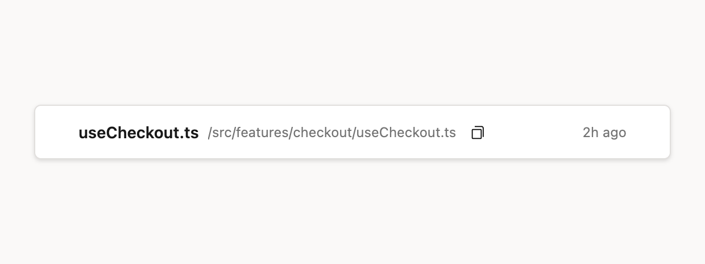
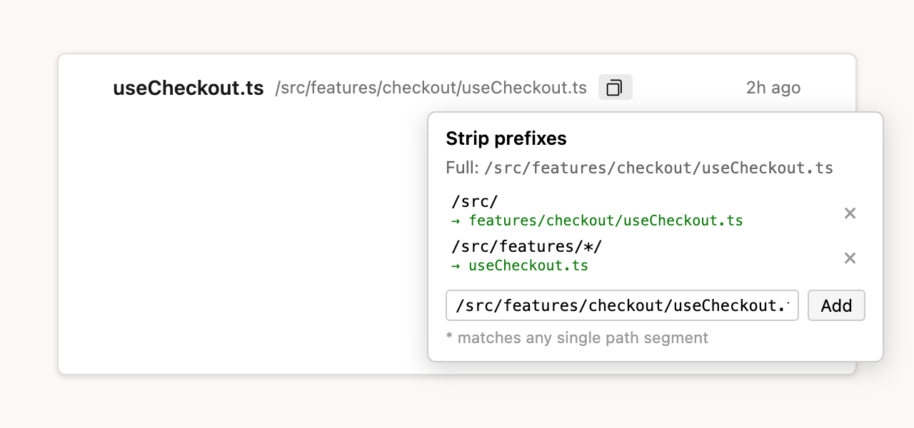
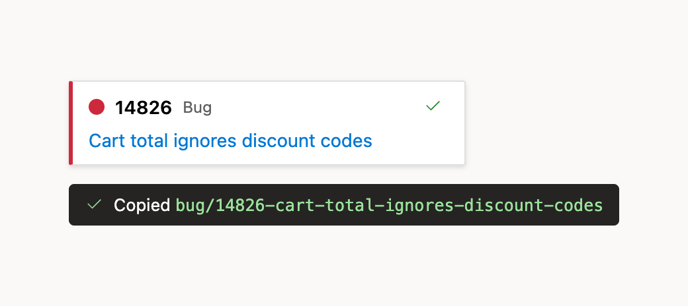

# Azure DevOps Toolbox

A single userscript for the whole team that adds quality-of-life helpers to
Azure DevOps pull requests and work items. Install once; it auto-updates from
this repo.

It bundles five features, each isolated so a failure in one can't break the
others.

> The screenshots below use placeholder data — paths, work items, and branch
> names are fictional.

## Install

1. Install a userscript manager: [Tampermonkey](https://www.tampermonkey.net/)
   or [Violentmonkey](https://violentmonkey.github.io/).
2. Open the raw script to trigger an install prompt:
   [`azureDevops.user.js`](https://raw.githubusercontent.com/Stan-Stani/userscripts/main/azureDevops/azureDevops.user.js)
3. Confirm the install. New versions roll out automatically via the script's
   `@updateURL` — no need to reinstall.

Works on `dev.azure.com` and legacy `*.visualstudio.com` hosts.

---

## 1. PR File Path Tools

Adds copy-to-clipboard buttons and full-path tooltips to file headers — on both
the **Overview** comment threads and the **Files** tab.

- **Click** the copy button — copies the path, with any configured prefix stripped.
- **Shift + click** — copies the full, untrimmed path.
- For a comment anchored to a specific line, the copied path includes the line
  number in editor/grep style: `…/useCheckout.ts:142`.

### Strip prefixes (right-click)

**Right-click** a copy button to manage "strip prefixes" — repo-relative
prefixes to drop so you copy just the part you care about. `*` matches any
single path segment. Prefixes are stored per-origin in `localStorage`, and a
live preview shows the result of each rule.

---

## 2. Branch Name from Work Item

Adds a copy button to sprint board cards and work item pages that copies a
ready-to-use branch name.

The branch name is `<prefix>/<id>-<kebab-title>`, where the prefix comes from the
work item type:

| Work item type | Prefix  |
| -------------- | ------- |
| Bug            | `bug`   |
| Change Request | `cr`    |
| User Story     | `us`    |
| Feature        | `feat`  |
| Task           | `task`  |

---

## 3. PR Hotkeys

| Action                                     | Windows         | macOS                  |
| ------------------------------------------ | --------------- | ---------------------- |
| Show only active (unresolved) comments     | `Ctrl` + `→`    | `Ctrl` + `Opt` + `→`   |
| Show all comments                          | `Ctrl` + `←`    | `Ctrl` + `Opt` + `←`   |
| Copy source branch name to clipboard       | `Win` + `]`     | `Cmd` + `Opt` + `]`    |

The macOS bindings differ on purpose: plain `Ctrl` + arrow is reserved by
Mission Control (switch spaces), and plain `Cmd` + `]` is the browser's Forward
navigation — so the Mac shortcuts add `Opt` to avoid both.

---

## 4. PR Dashboard Filters

Adds a **Filter PRs** menu to **My pull requests**. It can independently hide:

- Drafts
- Auto-complete pull requests
- Pull requests with conflicts

Drafts are hidden by default. Filter choices are stored per Azure DevOps origin
in `localStorage` and continue to apply as the dashboard updates.

---

## 5. Open PR in VS Code

Adds an **Open in VS Code** button beside the source branch in the pull request
header. It hands the PR to the
[AzDO Pull Requests (Multi-Project)](https://marketplace.visualstudio.com/items?itemName=zacharychristmas.azdo-pull-requests-multiproject)
extension via its `vscode://…/open-pr` deep link. The extension finds the
workspace folder that clones the repository and opens the PR's description page
(where **Checkout** is one click away) — no hunting for the PR in the sidebar.

- **Click** the button — open the PR in VS Code.
- **Alt/Option + click the branch name** — same thing. A plain click still
  navigates to the branch as usual.

The link lands in whichever VS Code window was focused last. If that window
doesn't have the repository open, the extension says so and offers to open the
PR on the web instead — focus the right window and click again.

### Requirements

- VS Code with **AzDO Pull Requests (Multi-Project)** 1.6.0 or newer
  (`zacharychristmas.azdo-pull-requests-multiproject`, on the Marketplace).
- The repository open in a VS Code window and the extension signed in.
- The first click makes the browser ask whether to open VS Code — tick
  "always allow" to skip it next time.

To target VS Code Insiders (or another `vscode://`-compatible editor), set
`localStorage["ado-vscode-uri-scheme"]` on the Azure DevOps origin to its URI
scheme, e.g. `vscode-insiders`.

---

## 6. Work Item Hotkeys

| Action                                | Windows          | macOS           |
| ------------------------------------- | ---------------- | --------------- |
| Save the discussion comment you're editing | `Ctrl` + `Enter` | `Cmd` + `Enter` |

Extra held modifiers are ignored, so `Cmd` + `Ctrl` + `Opt` + `Enter` works too —
the same leniency the pull request comment editor has. Out of the box the work
item form has no comment shortcut: its `Ctrl`/`Cmd` + `Enter` is a form-wide
**Save & Close** that only fires on an exact modifier match. While the cursor is
in a comment editor this shortcut saves just that comment and suppresses the
form-wide binding; elsewhere on the form nothing changes.

---

## 7. Work Item Modal

On a pull request, clicking a row in the **Work items** side panel opens that
work item in an on-page modal instead of navigating away from the PR.

- **Click** the row — open the work item in the modal.
- **Cmd/Ctrl/Shift + click** or **middle-click** — browser default (new tab).
- **Esc**, the **×**, or clicking the backdrop — close the modal.
- **Open full page ↗** in the modal header — the regular work item page.

The modal hosts the real work item form (`?fullScreen=true`, so no ADO header
or hub navigation), so editing, commenting and saving all work as usual — and
the Toolbox's work item features apply inside it. The side panel does not
refresh when the modal closes; reload the PR to see updated titles or states.

---

> **Upgrading from the old scripts?** This replaces the three separate scripts
> (`azureDevopsPRs-filePath`, `azureDevopsPRs-hotkeys`,
> `azureDevops-branchNameFromWI`). Uninstall those from your userscript manager
> first to avoid duplicate buttons.
